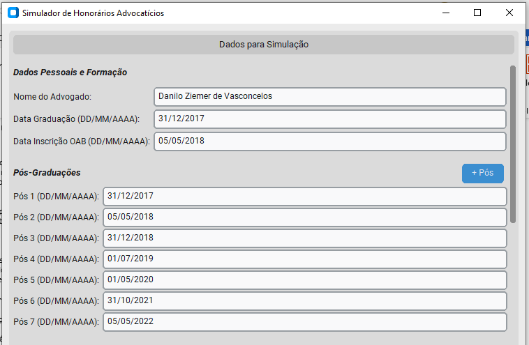
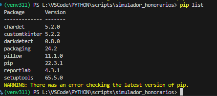
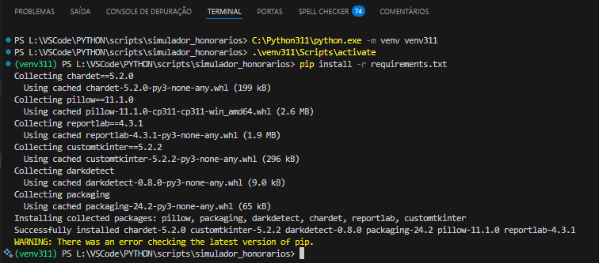
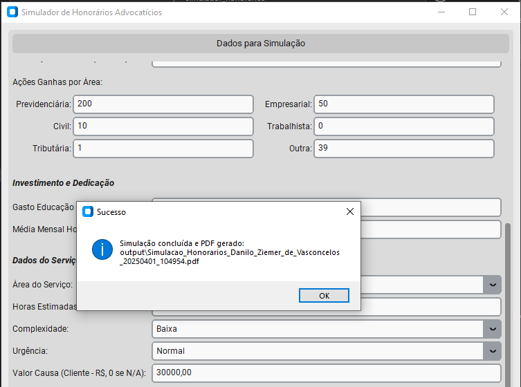
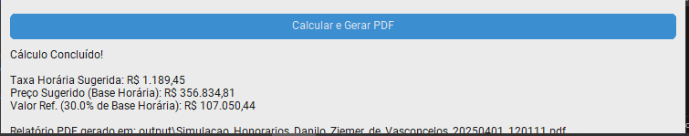

# ⚖️ Simulador de Honorários Advocatícios com Python e CustomTkinter 🐍

## 🎯 Objetivo

Este projeto tem como objetivo criar uma aplicação desktop que auxilia advogados a calcularem de forma **transparente e personalizada** seus honorários, levando em conta:

- Tempo de experiência;
- Quantidade e relevância de pós-graduações;
- Sucesso em casos anteriores;
- Investimento em educação contínua;
- Grau de complexidade e urgência do serviço.

A aplicação permite não só visualizar os valores calculados na interface gráfica, como também gerar um **relatório formal em PDF**, ideal para apresentar ao cliente.

## 🏗️ Estrutura do Projeto

O projeto é modular e dividido em pastas específicas:

- **main_gui.py**: Script principal que inicia a interface gráfica, com correções para DPI em sistemas Windows.
- **gui/app.py**: Define a interface com CustomTkinter, organizada com CTkLabels, CTkEntries e CTkComboBoxes.
- **core/formulas.py**: Contém toda a lógica de cálculo dos fatores que compõem a taxa horária e o preço final do serviço.
- **core/utils.py**: Funções auxiliares como formatação de moeda e manipulação de datas.
- **core/constants.py**: Valores e multiplicadores usados nas fórmulas, além de listas para os ComboBoxes.
- **reports/pdf_generator.py**: Responsável por gerar relatórios formais em PDF com os dados da simulação.
- **inputs.py**: Permite execução via terminal em modo texto (opcional).

## 🧮 Funcionalidades

- Interface gráfica intuitiva com rolagem e campos dinâmicos;
- Entrada de múltiplas pós-graduações;
- Validação automática de datas, inteiros, e valores monetários;
- Fatores de cálculo baseados em regras de negócio reais;
- Relatório PDF gerado com os detalhes de cálculo;
- Alertas para entradas consideradas fora do padrão.

## 💻 Tecnologias Utilizadas

- **Python 3.11+**
- **CustomTkinter** – interface gráfica moderna
- **ReportLab** – geração de PDF
- **tkinter.messagebox** – popups de erro e confirmação
- **datetime**, **math**, **unicodedata** – módulos nativos auxiliares

## 🚀 Como Executar

### 1. Clone o Repositório

git clone <https://github.com/IOVASCON/simulador_honorarios.git>
cd simulador_honorarios

### 2. Instale os requisitos

pip install -r requirements.txt

Ou, individualmente:

pip install customtkinter reportlab

### 3. Execute o Script Principal

python main_gui.py

## 🧾 Exemplo de Relatório

Ao finalizar a simulação, um PDF é gerado contendo:

- Nome do advogado
- Taxa horária sugerida
- Preço final do serviço
- Valor de referência por percentual de êxito (opcional)
- Detalhamento dos fatores aplicados

Exemplo do nome do arquivo gerado:

Simulacao_Honorarios_NomeAdvogado_20250401_142355.pdf

## 📂 Estrutura de Pastas

## 🐛 Problemas Conhecidos

- Em alguns ambientes Windows, o erro `bad screen distance "XXX.0"` pode ocorrer devido a configurações de DPI. Isso é resolvido com:

customtkinter.deactivate_automatic_dpi_awareness()

## 🖼️ Imagens do Desenvolvimento

1. Dependências do Projeto:

    

2. Ambiente Virtual:

    

3. Execução do Script:

    

4. Resultado da Simulação:

    

## 🤝 Contribuições

Contribuições são muito bem-vindas! Se você encontrar problemas ou tiver sugestões de melhorias:

- Abra uma issue para relatar o problema ou sugerir novas funcionalidades.
- Envie um pull request com suas contribuições.

## 👤 Autor

[Izairton] - [IOVASCON](https://github.com/IOVASCON)

## ✨ Melhorias Futuras

- Adição de tooltips e validação visual nos campos
- Exportação de simulações em outros formatos (JSON, Excel)
- Personalização de temas
- Empacotamento da aplicação em `.exe` com PyInstaller
